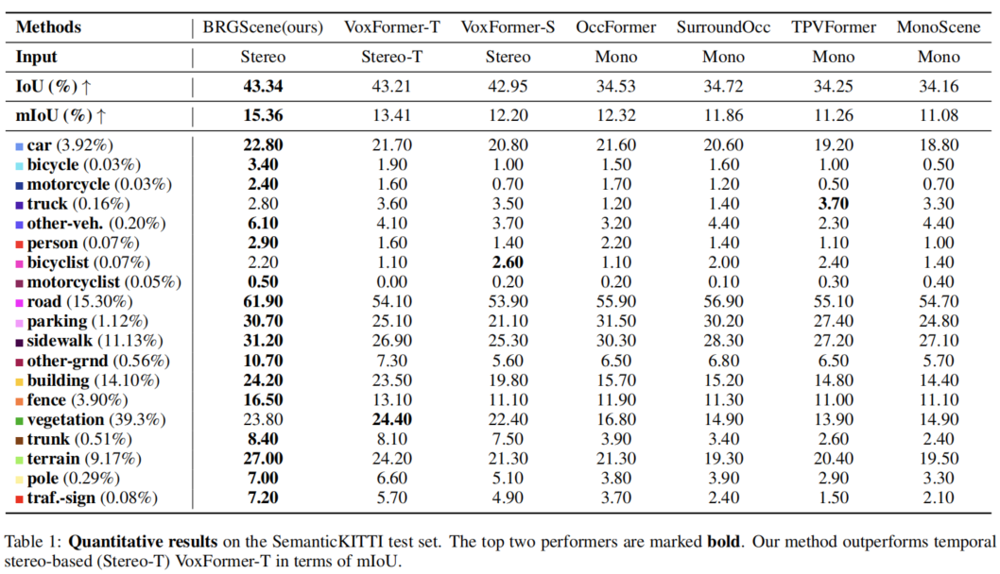

# StereoScene: BEV-Assisted Stereo Matching Empowers 3D Semantic Scene Completion

This repository contains the official implementation of the paper: "StereoScene: BEV-Assisted Stereo Matching Empowers 3D Semantic Scene Completion".

# Teaser
- **Comparison with MonoScene on SemanticKITTI:**
<p align="center">

</p>


- **Quantitative Results:**
<p align="center">

</p>

# Table of Content
- [News](#news)
- [Abstract](#abstract)
- [Installation](#step-by-step-installation-instructions)
- [Prepare Data](#prepare-data)
- [Pretrained Model](#pretrained-model)
- [Training & Evaluation](#training--evaluation)
- [License](#license)
- [Citation](#citation)
- [Acknowledgements](#acknowledgements)


# News
- [2023/03]: StereoScene paper is on [arxiv](https://arxiv.org/abs/2303.13959)
- [2023/03]: StereoScene demo and code released.

# Abstract
3D semantic scene completion (SSC) is an ill-posed task that requires inferring a dense 3D scene from incomplete observations. Previous methods either explicitly incorporate 3D geometric input or rely on learnt 3D prior behind monocular RGB images. However, 3D sensors such as LiDAR are expensive and intrusive while monocular cameras face challenges in modeling precise geometry due to the inherent ambiguity. In this work, we propose StereoScene for 3D Semantic Scene Completion (SSC), which explores taking full advantage of light-weight camera inputs without resorting to any external 3D sensors. Our key insight is to leverage stereo matching to resolve geometric ambiguity. To improve its robustness in unmatched areas, we introduce bird's-eye-view (BEV) representation to inspire hallucination ability with rich context information. On top of the stereo and BEV representations, a mutual interactive aggregation (MIA) module is carefully devised to fully unleash their power. Specifically, a Bi-directional Interaction Transformer (BIT) augmented with confidence re-weighting is used to encourage reliable prediction through mutual guidance while a Dual Volume Aggregation (DVA) module is designed to facilitate complementary aggregation. Experimental results on SemanticKITTI  demonstrate that the proposed StereoScene outperforms the state-of-the-art camera-based methods by a large margin with a relative improvement of **26.9% in geometry** and **38.6% in semantic**.


# Step-by-step Installation Instructions

Following https://mmdetection3d.readthedocs.io/en/latest/getting_started.html#installation

**a. Create a conda virtual environment and activate it.**
python > 3.7 may not be supported, because installing open3d-python with py>3.7 causes errors.
```shell
conda create -n occupancy python=3.7 -y
conda activate occupancy
```

**b. Install PyTorch and torchvision following the [official instructions](https://pytorch.org/).**
```shell
conda install pytorch==1.10.1 torchvision==0.11.2 torchaudio==0.10.1 cudatoolkit=11.3 -c pytorch -c conda-forge
```

**c. Install gcc>=5 in conda env (optional).**
I do not use this step.
```shell
conda install -c omgarcia gcc-6 # gcc-6.2
```

**c. Install mmcv-full.**
```shell
pip install mmcv-full==1.4.0
```

**d. Install mmdet and mmseg.**
```shell
pip install mmdet==2.14.0
pip install mmsegmentation==0.14.1
```

**e. Install mmdet3d from source code.**
```shell
cd mmdetection3d
git checkout v0.17.1 # Other versions may not be compatible.
python setup.py install
```

**f. Install other dependencies.**
```shell
pip install timm
pip install open3d-python
pip install PyMCubes
```


## Known problems

### AttributeError: module 'distutils' has no attribute 'version'
The error appears due to the version of "setuptools", try:
```shell
pip install setuptools==59.5.0
```


# Prepare Data

- **a. You need to download**

     - The **Odometry calibration** (Download odometry data set (calibration files)) and the **RGB images** (Download odometry data set (color)) from [KITTI Odometry website](http://www.cvlibs.net/datasets/kitti/eval_odometry.php), extract them to the folder `data/occupancy/semanticKITTI/RGB/`.
     - The **Velodyne point clouds** (Download [data_odometry_velodyne](http://www.cvlibs.net/download.php?file=data_odometry_velodyne.zip)) and the **SemanticKITTI label data** (Download [data_odometry_labels](http://www.semantic-kitti.org/assets/data_odometry_labels.zip)) for sparse LIDAR supervision in training process, extract them to the folders ``` data/lidar/velodyne/ ``` and ``` data/lidar/lidarseg/ ```, separately. 


- **b. Prepare KITTI voxel label (see sh file for more details)**
```
bash process_kitti.sh
```


# Pretrained Model

Download [StereoScene pretrained model](https://drive.google.com/file/d/1D0gP3S5uKo6pDZApCg7lrwOf5c5_yvC7/view?usp=share_link) on SemanticKITTI and [Efficientnet-b7 pretrained model](https://drive.google.com/file/d/1JffT44Zjw27XBTeUv8_RW6wP6GllMtZh/view?usp=share_link), put them in the folder `/pretrain`.


# Training & Evaluation

## Single GPU
- **Train with single GPU:**
```
export PYTHONPATH="."  
python tools/train.py   \
            projects/configs/occupancy/semantickitti/stereoscene.py
```

- **Evaluate with single GPUs:**
```
export PYTHONPATH="."  
python tools/test.py  \
            projects/configs/occupancy/semantickitti/stereoscene.py \
            pretrain/pretrain_stereoscene.pth 
```


## Multiple GPUS
- **Train with n GPUs:**
```
bash run.sh  \
        projects/configs/occupancy/semantickitti/stereoscene.py n
```

- **Evaluate with n GPUs:**
```
 bash tools/dist_test.sh  \
            projects/configs/occupancy/semantickitti/stereoscene.py \
            pretrain/pretrain_stereoscene.pth  n
```


# License
This repository is released under the Apache 2.0 license as found in the [LICENSE](LICENSE) file.

# Citation
If you find this project useful in your research, please consider cite:
```
@misc{li2023stereoscene,
      title={StereoScene: BEV-Assisted Stereo Matching Empowers 3D Semantic Scene Completion}, 
      author={Bohan Li and Yasheng Sun and Xin Jin and Wenjun Zeng and Zheng Zhu and Xiaoefeng Wang and Yunpeng Zhang and James Okae and Hang Xiao and Dalong Du},
      year={2023},
      eprint={2303.13959},
      archivePrefix={arXiv},
      primaryClass={cs.CV}
}
```

# Acknowledgements
Many thanks to these excellent open source projects: 
- [MonoScene](https://github.com/astra-vision/MonoScene)
- [mmdet3d](https://github.com/open-mmlab/mmdetection3d)
- [BEVDepth](https://github.com/Megvii-BaseDetection/BEVDepth)
- [SSC](https://github.com/waterljwant/SSC)
- [LMSCNet](https://github.com/astra-vision/LMSCNet)
- [Semantic-kitti-api](https://github.com/PRBonn/semantic-kitti-api) 
- [Pseudo_Lidar_V2](https://github.com/mileyan/Pseudo_Lidar_V2)
- [BEVFormer](https://github.com/fundamentalvision/BEVFormer)

