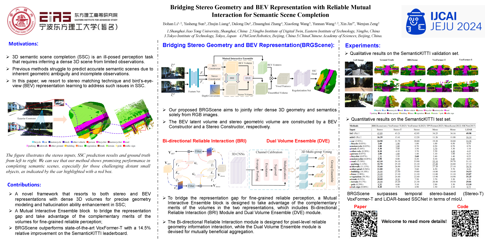
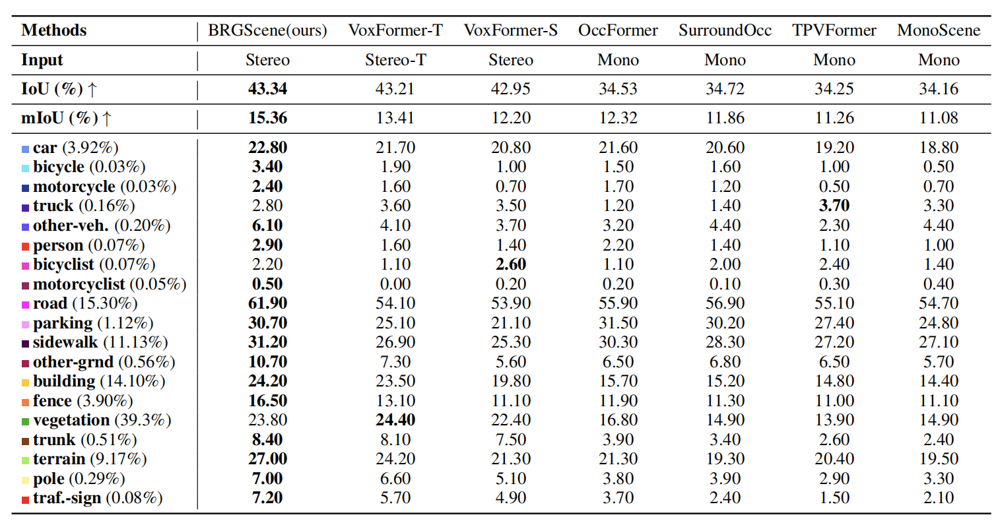

## [IJCAI 2024] Bridging Stereo Geometry and BEV Representation with Reliable Mutual Interaction for Semantic Scene Completion 


### Poster:
<div align=center></div>


### Demo:
<div align=center></div>


## Benchmark Results
<div align=center></div>


# Table of Content
- [News](#news)
- [Installation](#step-by-step-installation-instructions)
- [Prepare Data](#prepare-data)
- [Pretrained Model](#pretrained-model)
- [Training & Evaluation](#training--evaluation)
- [License](#license)
- [Acknowledgements](#acknowledgements)


# News
- [2024/04]: Paper is accepted on IJCAI 2024
- [2023/03]: Paper is on [arxiv](https://arxiv.org/abs/2303.13959)
- [2023/03]: Demo and code released.


# Step-by-step Installation Instructions

Following https://mmdetection3d.readthedocs.io/en/latest/getting_started.html#installation

**a. Create a conda virtual environment and activate it.**
python > 3.7 may not be supported, because installing open3d-python with py>3.7 causes errors.
```shell
conda create -n occupancy python=3.7 -y
conda activate occupancy
```

**b. Install PyTorch and torchvision following the [official instructions](https://pytorch.org/).**
```shell
conda install pytorch==1.10.1 torchvision==0.11.2 torchaudio==0.10.1 cudatoolkit=11.3 -c pytorch -c conda-forge
```

**c. Install gcc>=5 in conda env (optional).**
I do not use this step.
```shell
conda install -c omgarcia gcc-6 # gcc-6.2
```

**c. Install mmcv-full.**
```shell
pip install mmcv-full==1.4.0
```

**d. Install mmdet and mmseg.**
```shell
pip install mmdet==2.14.0
pip install mmsegmentation==0.14.1
```

**e. Install mmdet3d from source code.**
```shell
cd mmdetection3d
git checkout v0.17.1 # Other versions may not be compatible.
python setup.py install
```

**f. Install other dependencies.**
```shell
pip install timm
pip install open3d-python
pip install PyMCubes
```


## Known problems

### AttributeError: module 'distutils' has no attribute 'version'
The error appears due to the version of "setuptools", try:
```shell
pip install setuptools==59.5.0
```


# Prepare Data

- **a. You need to download**

     - The **Odometry calibration** (Download odometry data set (calibration files)) and the **RGB images** (Download odometry data set (color)) from [KITTI Odometry website](http://www.cvlibs.net/datasets/kitti/eval_odometry.php), extract them to the folder `data/occupancy/semanticKITTI/RGB/`.
     - The **Velodyne point clouds** (Download [data_odometry_velodyne](http://www.cvlibs.net/download.php?file=data_odometry_velodyne.zip)) and the **SemanticKITTI label data** (Download [data_odometry_labels](http://www.semantic-kitti.org/assets/data_odometry_labels.zip)) for sparse LIDAR supervision in training process, extract them to the folders ``` data/lidar/velodyne/ ``` and ``` data/lidar/lidarseg/ ```, separately. 


- **b. Prepare KITTI voxel label (see sh file for more details)**
```
bash process_kitti.sh
```


# Pretrained Model

Download [Pretrained model](https://drive.google.com/file/d/1D0gP3S5uKo6pDZApCg7lrwOf5c5_yvC7/view?usp=share_link) on SemanticKITTI and [Efficientnet-b7 pretrained model](https://drive.google.com/file/d/1JffT44Zjw27XBTeUv8_RW6wP6GllMtZh/view?usp=share_link), put them in the folder `/pretrain`.


# Training & Evaluation

## Single GPU
- **Train with single GPU:**
```
export PYTHONPATH="."  
python tools/train.py   \
            projects/configs/occupancy/semantickitti/stereoscene.py
```

- **Evaluate with single GPUs:**
```
export PYTHONPATH="."  
bash run_eval_kitti.sh   \
            projects/configs/occupancy/semantickitti/stereoscene.py \
            pretrain/pretrain_stereoscene.pth  1
```


## Multiple GPUS
- **Train with n GPUs:**
```
bash run.sh  \
        projects/configs/occupancy/semantickitti/stereoscene.py n
```

- **Evaluate with n GPUs:**
```
 bash tools/dist_test.sh  \
            projects/configs/occupancy/semantickitti/stereoscene.py \
            pretrain/pretrain_stereoscene.pth  n
```


# License
This repository is released under the Apache 2.0 license as found in the [LICENSE](LICENSE) file.


# Acknowledgements
Many thanks to these excellent open source projects: 
- [MonoScene](https://github.com/astra-vision/MonoScene)
- [mmdet3d](https://github.com/open-mmlab/mmdetection3d)
- [BEVDepth](https://github.com/Megvii-BaseDetection/BEVDepth)
- [SSC](https://github.com/waterljwant/SSC)
- [LMSCNet](https://github.com/astra-vision/LMSCNet)
- [Semantic-kitti-api](https://github.com/PRBonn/semantic-kitti-api) 
- [Pseudo_Lidar_V2](https://github.com/mileyan/Pseudo_Lidar_V2)
- [BEVFormer](https://github.com/fundamentalvision/BEVFormer)


## Citation
If you find our paper and code useful for your research, please consider citing:
```bibtex
@misc{li2024bridging,
      title={Bridging Stereo Geometry and BEV Representation with Reliable Mutual Interaction for Semantic Scene Completion}, 
      author={Bohan Li and Yasheng Sun and Zhujin Liang and Dalong Du and Zhuanghui Zhang and Xiaofeng Wang and Yunnan Wang and Xin Jin and Wenjun Zeng},
      year={2024},
      journal={IJCAI},
      year={2024}
}
```
